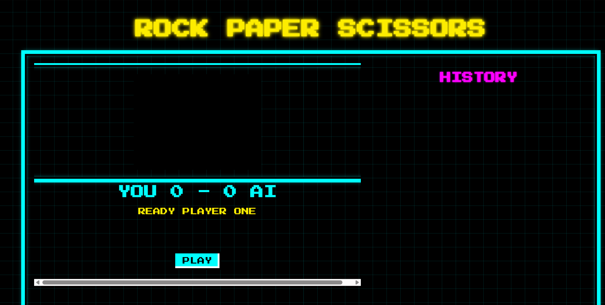

+++
title = '挑战一百个AI轻应用之，无聊的石头剪刀布'
date = 2025-08-04
draft = false
lang = 'zh'
+++

不知道你们如何打发上下班路途上这无聊的时间。我以前会看剧，听故事。但时间长了，发现脑子不肯停下来。经常听着故事或看着剧，脑子却不知道飞到哪里去了，最后也不知道我在听什么或者看什么。

后来我喜欢上了与AI聊天。于是这个有些无聊，但自我感觉有趣的创意就这么诞生在了周五的下班路。

## 初遇挑战：AI的“不靠谱”建议

一开始AI的反馈还比较传统。它建议我自己部署模型来训练识别石头剪刀布。拍50张石头照片，50张剪刀照片，50张布的照片。不同角度，不同大小，最好还不同人的手，来训练模型识别的准确率。我顿时就一头两个大。我要是有这本事，我还会让你帮我编程么？我自己去字节跳动找个工作不香么？

## 轻量化：Cloudflare Worker的妙用

**轻应用，最重要的就是要轻。** 一开始我还想用自己的云服务器来部署Python做后端。可是正好我申请了Cloudflare托管自己的域名。转念一想，为什么不用Cloudflare 的worker来部署JS来实现我的想法呢？作为一个实验性质，并且不会有很多人玩的游戏，这不是节省花费的完美选择吗？

## 实干：QWen3 Coder初体验

说干咱就干。正好QWen3 Coder发布，一时间在网上褒贬皆有。我不敢在本地安装Qwen3 Coder，生怕一不小心银行卡余额被清零。所以，我把我的需求放在QWen3 的网页版里：[https://chat.qwen.ai/](https://chat.qwen.ai/) 我最初的目标很简单：

1. 一个html页面，打开摄像头。一个按钮点击后拍张照片传给后端的javascript.
    
2. 一个javascript，接收传来的图片，让一个AI模型去辨认。并行的，让另一个AI模型去决策出石头，剪刀，还是布。
    

不考虑策略，不考虑容错，先把流程跑通。

对付这样一个小需求，Qwen3 Coder看起来像是一把杀鸡的牛刀。三下五除二就把代码生成完毕。还将我当一个新瓜蛋子一样，指导我如何上传到Cloudflare的Pages 和Worker上，然后如何将两者连接起来。别说，我还真需要。因为我真不会。

## 排错之旅：Claude Code与Gemini CLI的协作

代码生成是一回事，让它跑起来又是一回事。对编代码没概念的我，正好用配置好的Cluade Code 和Gemini CLI来干这活儿。在这次的排错旅程中，_Claude Code是绝对担当，它修改一个错误的效率和准确率确实比Gemini CLI高。_ 代价就是token要花钱，但Kimi的价格称得上是物美价廉。

用Claude Code的方便之处在于，它会在你的许可下，自己修改代码。如果是像python这种本地开发的应用，它还可以调用shell来运行，自己抓取错误信息继续分析。完美闭环。

对于我现在的排错，麻烦的点在于，我只能一遍又一遍的把修改后的代码上传到Pages 或woker.js，然后再刷新来看效果。效率确实不高。当然，你可以安装一个miniflare来本地运行。但我嫌麻烦。反正Cluade Code会重新生成代码，我做一下copy/paste，重新刷新页面的工作，还可以忍受。

### 遇到的“拦路虎”

卡在运行起来之前的一大块石头，是我用了SiliconFlow的免费模型THUDM/GLM-4.1V-9B-Thinking来做手势识别。但代码里为了保证图片的识别里不会有随机性，所以将temperature设置为了0。然后调用API一直返回400错误。我是半点不懂，但看起来Cluade Code 和Gemini CLI在这方面也是半斤八两。我想了个小花招，我在让他们在本地写了一个Python，用同样的调用参数。然后不就可以本地闭环排错了么？这时候Claude Code的长处就体现出来了，它主动更换模型尝试。换到Pro/Qwen/Qwen2.5-VL-7B-Instruct 便跑通了识别的流程。准确率不错。

第二块小石头是，我选了一个reasoning 的模型来做出拳的决策，因为我个人感觉如果选MOE，同样的提示词，会导致每次返回的选择都是同一个手势。但结果是，reasoing的模型开启了深思熟虑模式，直接把反馈的时间拉长到worker timeout。我依然是写了个Python程序模拟JS里的流程，发现这个Reasoning 模型果然想的很多，脑子里一会儿说我应该选拳头，一会儿说应该没有那么简单，我要再想一想。于是果断修改提示词，告诉它，不要多想，立刻回答。速度立刻缩短到10秒以内。测试了多次，不会一直同一个选择。

## 改善与展望

跑通以后的工作就是改善了。我首先从UI开始，改了个复古街机风格。看起来挺有趣，有点梦回80年代的感觉。

然后我想调优一下AI出拳的逻辑。因为现在是完全随机的，我尝试带入过往战绩让AI做决策。但是发现这极大的增加了Reasoning模型的思维链，反馈速度甚至达到了1-2分钟。所以我又退回了原来的随机模式。但无论如何，这一步，已经可以游戏了。

## 写在最后

AI的出现，特别是Claude Code，极大的方便了你我一样的普通人去写一点我们生活工作中需要的小应用。我们每个人都应该尝试一下。会给我们的生活和工作带来很大的方便和乐趣。

我想给自己设立一个小目标，挑战完成100个无聊但是有趣的轻应用。你们有什么建议吗？

---
lang: zh
