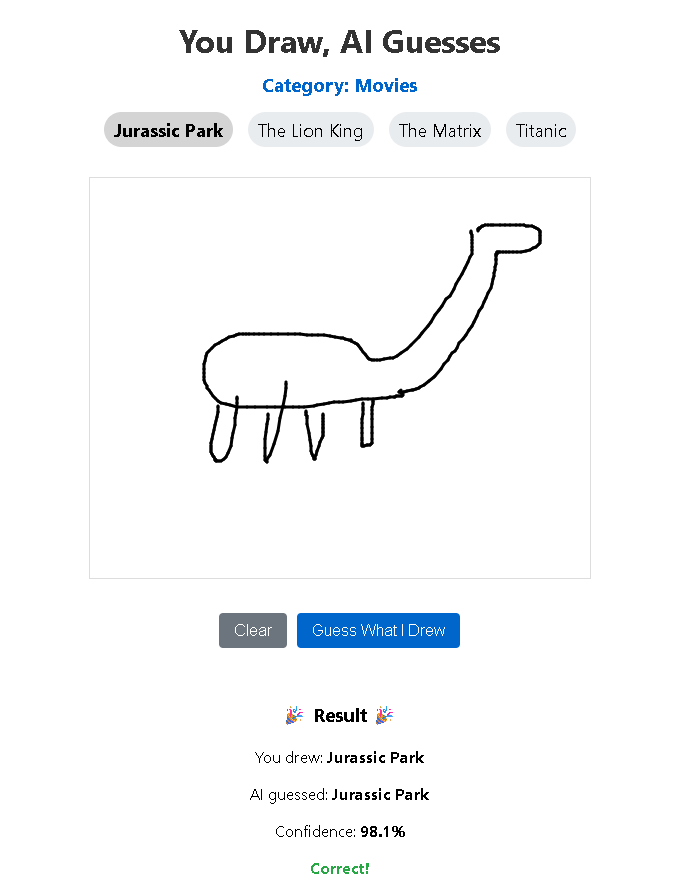
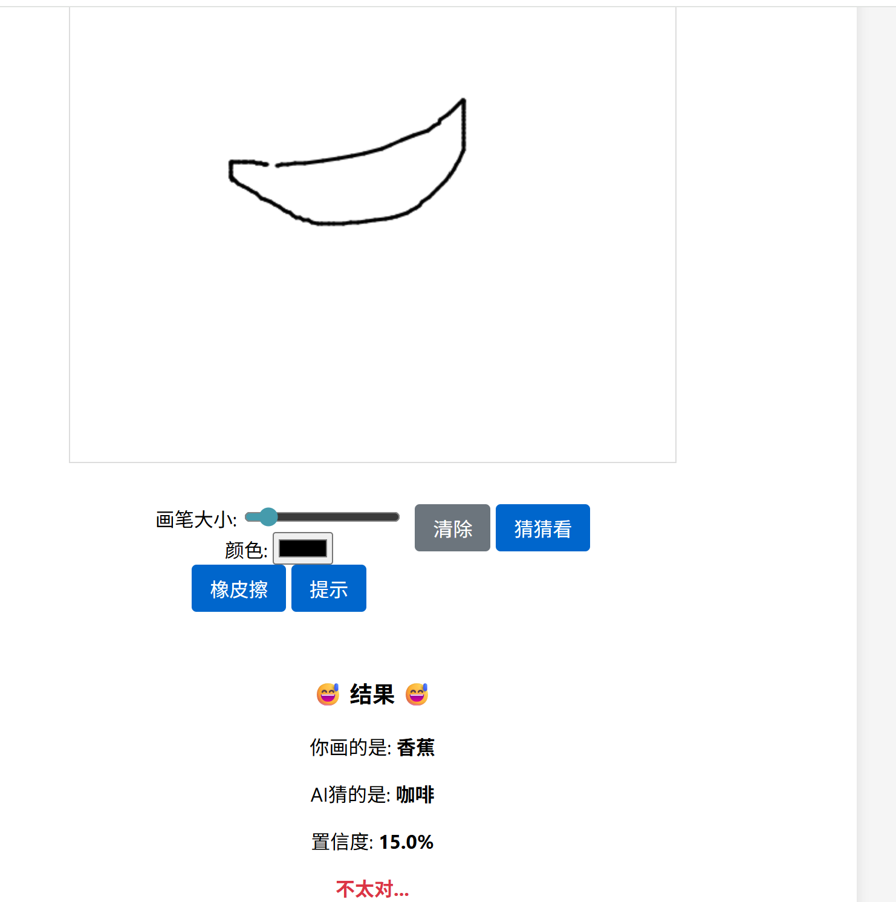

+++
title = 'Draw_guess'
date = 2025-08-10T11:00:28+08:00
draft = false
+++

大家好，我是老V。一个非常不专业的AI不极客。
今天给大家带来的是我的又一个无聊的小应用

请忽略我丑陋的画作。聚焦在这个我觉得还算有点创意，却真的有点无聊的小游戏。这个创意CLaude code化了5分钟就完成，并且部署到了Cloudflare上。唯一的缺点就是。。。。猜的真不准
你们可以评评理，我画的确实很差，但这跟咖啡有半毛钱关系吗？

于是接下去更多的工作就花在怎么让它变得更聪明上。
1）画完了要先处理（我不是很理解为什么，但是Cluade Code说的一定是对的）
2）更换提示词。要循循善诱
3） 更换模型。这个小项目完全基于Cloudflare的免费资源，包括AI。第一次ClaudeCode找了个纯文本的模型，第二次他自己打自己脸说要帮我换一个。
4） 模型一般都说英文，它要增加中英文对照。并且采取模糊策略，相似就算猜对

现在他在改，我在写这篇文章。这周挑战有点水，大家一笑了之吧。
你们对一百个AI轻应用有什么想法？给我个题目我来做吧？

我是老V，一个非常不专业的AI领域创作者。想了解更多AI科技动态？欢迎关注我的博客 “AI布知道”，获取最新AI资讯与深入解析！ 博客链接：https://blog.vftl.top 或 https://blog.vftl.site
